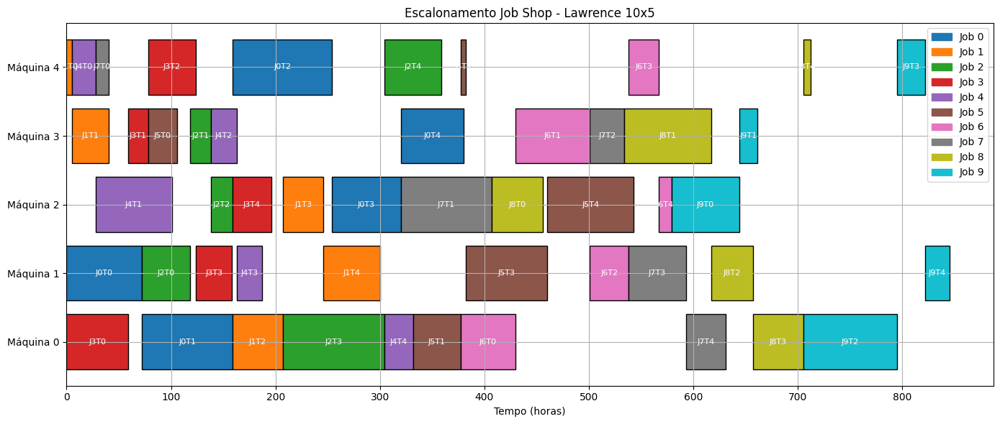

# Pacman - Busca em Largura, Profundidade, Bidirecional e A*

## Definindo g para caminhos com ou sem comida

- Se o próximo movimento for um caminho com comida, o valor de g é 0.
- Se o próximo movimento for um caminho sem comida, o valor de g é 1.

## Busca em largura

### Solver sem poda com matriz 4x4

Iterações: 804

### Solver com poda com matriz 4x4

Iterações: 73

### Solver com poda para todos os campos

- Field 1: 73 iterações
- Field 2: 1175 iterações
- Field 3: 11465 iterações
- Field 4: 17126 iterações
- Field 5: 171718 iterations

### Conclusões

- Ao aumentar o campo para 5x5, o algoritmo de busca em largura sem poda gastou um tempo muito grande, tornando-se inviável
- A busca em largura com poda se mostrou mais eficiente que a busca em largura sem poda
- Uma desvantagem da utilização de um algoritmo de busca em largura é a prioridade de nodos mais antigos frente a nodos mais recentes, mesmo com esses tendo melhores perspectivas de resolução do problema

## Busca em profundidade

### Solver sem poda com matriz 4x4

Iterações: 1880

### Solver com poda com matriz 4x4

Iterações: 98

OBS: As poda utilizada é a mesma desenvolvida na busca em largura. 

### Solver com poda para todos os campos

- Field 1: 98 iterations
- Field 2: 1389 iterations
- Field 3: 11367 iterations
- Field 4: 15760 iterations

### Conclusões

- A busca em profundidade com poda se mostrou mais eficiente que a busca em profundidade sem poda
- A busca em largura se mostrou mais eficiente que a busca em profundidade, tanto com poda quanto sem poda

## Busca bidirecional

Foi necessário criar uma função a mais na classe dos Nodos para incluir a geração de estados em retrospectiva (*backtrack*). Ou seja, poder gerar os estados a partir do estado final, até o estado inicial.

### Solver sem poda com matriz 4x4

Iterações: 77

### Solver com poda com matriz 4x4

Iterações: 38

### Solver com poda para todos os campos

- Field 1: 38 iterations
- Field 2: 205 iterations
- Field 3: No solution found
- Field 4: No solution found

### Conclusões

- A busca bidirecional se mostrou mais eficiente que a busca em largura e a busca em profundidade para os dois primeros campos, tanto com poda quanto sem poda
- A busca bidirecional não conseguiu encontrar solução para os campos 3 e 4, mesmo com poda
- O algoritmo da busca bidirecional necessita que seja indicada a posição final do Pacman, sendo configurado, nesse caso, como a posição (0,0) do campo. Porém, a escolha dessa última posição afeta o número de movimentos finais, assim, sendo necessário encontrar uma forma automática de encontrar a melhor posição final para o Pacman

## Busca A*

### Explicação da heurística

O algoritmo apresentado é uma variação da busca A* que utiliza uma heurística baseada na distância até a fruta mais próxima, somada à profundidade atual do nó (ou seja, o número de movimentos já realizados). Essa heurística tem como objetivo guiar o Pacman de forma eficiente em direção ao objetivo (comer todas as frutas no mapa), priorizando caminhos promissores sem explorar o estado inteiro do espaço de busca.

Apesar de utilizar uma heurística inspirada na A*, o algoritmo foi intencionalmente ajustado para se comportar de forma mais próxima de uma busca em profundidade. Isso é feito ao inserir os nós filhos ordenados no início da fronteira, em vez de manter uma fila de prioridade ou reordenar toda a fronteira a cada iteração. Essa escolha permite que o algoritmo siga uma trajetória contínua (mantendo a direção), o que reduz drasticamente o número de estados explorados.

- **Vantagem**

O algoritmo reduz significativamente o número de iterações em comparação com versões tradicionais de A*, Busca em largura ou Busca em Profundidade puros. Por exemplo, enquanto outras estratégias podem exigir centenas ou milhares de iterações, esta abordagem pode encontrar uma solução em poucas dezenas.

- **Limitação**

Como os nós não são reinseridos ou reavaliados caso uma nova trajetória mais curta seja descoberta posteriormente, e como o algoritmo prioriza a continuidade da trajetória em vez do custo global mínimo, ele pode encontrar uma solução viável, mas não ótima (ou seja, pode não ser o caminho mais curto possível).

### Solver sem poda com matriz 4x4

Iterações: não conseguiu completar

### Solver com poda com matriz 4x4

Iterações: 45

### Solver com poda para todos os campos

- Field 1: 45 iterations
- Field 2: 52 iterations
- Field 3: 70 iterations
- Field 4: 115 iterations

# Modelagem e Resolução de Problemas via CSP

Este repositório contém dois problemas resolvidos através de técnicas de **Constraint Satisfaction Problem (CSP)**:  
1. Alocação de Sessões em Evento  
2. Escalonamento Job Shop Lawrence 10×5

---

## 1. Alocação de Sessões

### Enunciado

Os organizadores de um um evento acadêmico reservaram 3 salas por 2 dias. O evento tem 11 sessões técnicas de meio-dia cada, identificadas por letras A, B, ..., K. As sessões AJ não podem acontecer simultaneamente, assim como JI, IE, CF, FG, DH, BD, KE, BIHG, AGE, BHK, ABCH e DFJ. Além disso, a sessão E deve preceder a sessão J, e as sessões D e F devem preceder a sessão K. A sessão A deve ser alocada no início do primeiro dia e a sessão J no final do segundo dia. A tarde do segundo dia deve incluir 2 sessões. O problema é indicar quando e onde ocorrem as sessões do evento.

### Definição

- Sessões: A até K (11 no total)
- Cada sessão é alocada a um triplo `(dia, turno, sala)`
  - Dias: 1 ou 2
  - Turnos: manhã (M) ou tarde (T)
  - Salas: 1, 2 ou 3
- Total de combinações possíveis por sessão: 12

### Restrições

- **Não simultaneidade**: Grupos de sessões não podem ocorrer no mesmo turno.
- **Precedência**: Algumas sessões devem ocorrer antes de outras.
- **Fixação de horários**:
  - Sessão A: dia 1, manhã
  - Sessão J: dia 2, tarde
- **Sessões na tarde do segundo dia**: exatamente 2 sessões devem ser alocadas.
- **Exclusividade de sala**: nenhuma sala pode ser usada por mais de uma sessão ao mesmo tempo.

### Solução

| Sessão | Dia | Turno | Sala   |
|--------|-----|--------|--------|
| A      | 1   | M      | Sala1 |
| B      | 1   | T      | Sala1 |
| C      | 2   | M      | Sala1 |
| D      | 1   | M      | Sala2 |
| E      | 1   | T      | Sala2 |
| F      | 1   | T      | Sala3 |
| G      | 2   | M      | Sala2 |
| H      | 2   | T      | Sala1 |
| I      | 1   | M      | Sala3 |
| J      | 2   | T      | Sala2 |
| K      | 2   | M      | Sala3 |

---

## 2. Escalonamento Job Shop (Lawrence 10×5)

### Enunciado

O problema “jobshop” consiste no escalonamento de um número de tarefas de um trabalho em um conjunto de máquinas disponíveis. Por exemplo, considerando a tabela 1 (figura \ref{jobshop}), o trabalho 1 tem 5 tarefas, a primeira tarefa leva 72 horas para ser completada e precisa ser feita na máquina 1. No caso, todos os trabalhos têm 5 tarefas. Também temos 5 máquinas (identificadas por 0, 1, 2, 3, 4). As tarefas de cada trabalho devem ser feitas em sequência. O problema é determinar em que momento cada tarefa deve ser realizada e em qual máquina.

### Definição

- Tarefas: Cada job `j` (de 0 a 9) possui 5 tarefas `k` (de 0 a 4)
- Variáveis: `T_jk` representa o instante de início da tarefa `k` do job `j`
- Domínio de cada `T_jk`: `{0, ..., H - d_jk}`
  - `d_jk` é a duração da tarefa
  - `H` é o horizonte de tempo total (soma de todas as durações)

### Restrições

- **Não simultaneidade em máquinas**: Tarefas alocadas à mesma máquina não podem se sobrepor
  - `T_jk + d_jk <= T_j'k'` ou `T_j'k' + d_j'k' <= T_jk`
- **Precedência entre tarefas do mesmo job**:
  - `T_jk >= T_j(k-1) + d_j(k-1)` para `k > 0`

### Estratégia

A resolução é feita com técnicas de CSP que garantem:
- alocação exclusiva nas máquinas,
- ordem correta das tarefas em cada job,
- escalonamento viável dentro do horizonte de tempo.

### Solução

